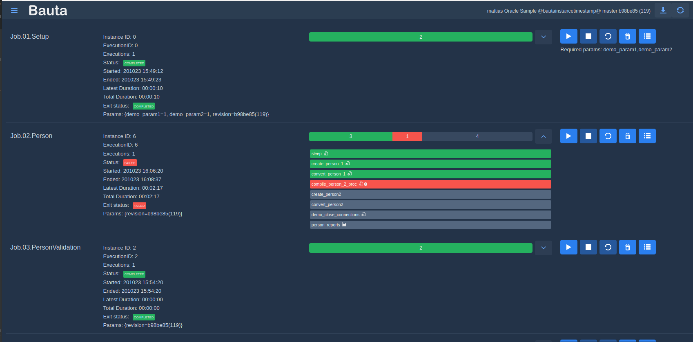

# Bauta
Bauta is a batch automation framework based on [Spring Batch](https://spring.io/projects/spring-batch) and [Spring Boot](https://spring.io/projects/spring-boot). It adds a user interface in which you can start/stop/restart jobs, monitor step/job status. Also provides some add-ons to jobs and steps, such as report/log generation, job parameter handling etc. 

You can run your jobs locally on your personal computer or on a server to support team collaboration. It can be setup to automatically stop, install latest batch jobs/scripts etc from GIT and restart. This makes it convenient for teams to develop and deploy their batch jobs.

*Job view*

*Scheduling view*

## Features:
- A convenient way to get started with Spring Batch
- Start/stop/restart jobs via a web-based user interface
- Watch job/step progress and status.
- Steps can generate output that can be displayed in the UI. Typically reports, script logs, stack traces etc.
- Provides "starter" and example projects for different usage scenarios
- Supports "DevOps" way of developing your Jobs/Steps in a collaborative, automated fashion

## Use cases
- Data migration/ETL
- Batch processing

### Scheduling
Bauta lets you schedule jobs to start at times specified by a CRON expression. This is useful for starting import jobs, running your daily integration dry-runs during development etc.

### Triggering
The successful completion of a job can be setup to trigger the start of another job.
This enables you to automate complete chains of job executions and to control the order of execution when jobs depend on each other.

## Modules
|Module         |Description|
|------------------|------------------------------------------------------------------------------|
|bauta-starter|Starter project. Use this as a parent and starter for your Bauta-based project. See sample modules for how to use it|
|bauta-sample|Very basic sample project, using some basic spring batch features|
|bauta-sample-oracle|Sample project demonstrating how to work with an Oracle database as the stagingDB. Shows how to execute PLSQL scripts and run stored procedures using the dbms_scheduler| 
|bauta-core|The core functionality of Bauta. Batch job managements, UI, command-line etc|
|bauta-autoconfigure|Manages auto-configuration. Currently limited, but when Bauta grows this will be used to make sure not to start unnecessary features/resources|

## Getting started

### Try out sample applications
1. Clone one of the bauta-sample modules to get started.
2. You need Java SDK 1.8 or later and Maven to build and run the application. To build: mvn clean install
3. Create a home directory for logs, job configuration files, reports etc. Set bauta.homeDir.
4. If you will use a Staging DB, setup url, username etc in the configuration
5. Create job configurations and put them in bauta.jobDir
6. Run the application using the run.sh script. The application will be available at http://localhost:8080/ui
7. Start your job by clicking the play button

### Build your own application
1. Create your own Maven-based project which depends on `bauta-starter`. Use sample projects as a starting point
2. Follow steps 2-7 above

## Configuration

Properties can be provided by your application in several ways
- application.properties or application.yml
- Environment variable
- Command line arguments

Property|Description|
--------|-----------|
bauta.homeDir|The home/base directory for configuration, logs etc|
bauta.reportDir|This is where all kinds of reports generated by steps/tasklets will be written. Default to ${bauta.homeDir}/reports|
bauta.scriptDir|Scripts executed in steps

